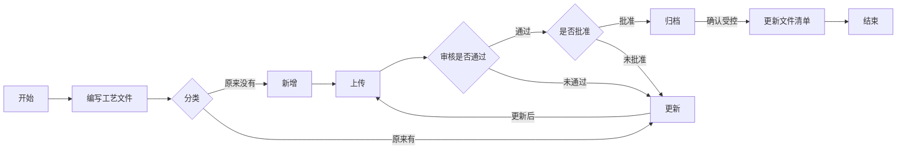

# 开始写工艺文件管理系统

解决工艺文件的流程问题，通过自动化的流程，更新工艺文件清单，简化工艺文件审批流程。

---

### 工作流程

1. 主管工艺员根据模板编写工艺文件
1. 上传工艺文件（是否需要转换为pdf？）
1. 通过组长审核
1. 主管批准
1. 添加签名信息（统一添加 or 流程时分步添加？）
1. 反至资料员处（是否需要？）
1. 确认后制作清单并更新（手动还是自动更新？）（自动的同时增加手动按钮，进行确认）

### 文件存储

工艺文件存储到系统本地，数据库中存相对路径

文件清单进行分步存储，做为链接可打开

---

## 程序设计

人员系统 文件系统 权限系统（？）查找系统（通过文件名，编号，编制人，工序）

1. 人员系统
   - 人员信息
     - 工号（做为外键）
     - 用户名
     - 密码
     - 登录状态（单用户登录使用，查看是否在线？是否需要？上线通过登录确认，如何确认下线状态？cookie存储登录时间）
   - 权限信息
     - 上传（使用异步还是同步？是否需要用户等待上传结果返回？异步通过弹窗还是后台消息？异步是否存在多次点击问题，是否需要限制短时间点击次数）
     - 审核
     - 批准
     - 归档
     - 删除（工艺文件删除是假删除还是真删除，做为状态值删除，或者彻底删除）
     - 更新（更新后是做为同名文件覆盖，或者通过版本号进行区分，若存在多种版本，是否需要受控状态）（更新是只能更新个人文件或是工序文件？存在工艺文件交接问题）
     - 驳回
   - 分工
     - 工序分工
2. 文件系统
   - 工艺文件
     - 名称
     - 版本（需要确定版本号更新的条件，大版本更新前缀，小版本更新后缀）
     - 日期（日期和版本手动填写或是自动反写）
     - 编号
     - 人员
     - 文件内容
     - 工序
   - 文件清单
     - 编号
     - 更新日期
     - 更新方式（手动、自动（每天0点更新，确保编号的唯一性））
3. 权限系统（将工艺文件的编辑方法放着还是存在人员系统中？分成两个系统存在跨表查询，放在人员信息中会将人员表存放过大）

---

## 流程图

---

## 数据库结构设计

1. 人员表

   | 序号 | 字段名 | 字段类型 | 值类型   |
   | :--- | :----- | -------- | :------- |
   | 1    | 序号   | int      | 主键自增 |
   | 2    | 工号   | int32    | 外键唯一 |
   | 3    | 姓名   | char     |          |
   | 4    | 密码   | char     |          |

2. 文件表

   | 序号 | 字段名               | 字段类型 | 值类型    |
   | ---- | -------------------- | -------- | --------- |
   | 1    | 序号                 | int      | 主键自增  |
   | 2    | 文件编号             | char     | 唯一 外键 |
   | 3    | 文件名称             | char     | 唯一      |
   | 4    | 上传人               | char     |           |
   | 5    | 初次上传时间(时间戳) | int      |           |
   | 6    | 最后更新时间(时间戳) | int      |           |
   | 7    | 版本号               | char     |           |
   | 8    | 工序                 | char     |           |
   | 9    | 存储位置             | char     |           |
   | 10   | 文件状态             | int      |           |

3. 权限信息

   | 序号 | 字段名 | 字段类型 | 值类型   |
   | ---- | ------ | -------- | -------- |
   | 1    | 序号   | int      | 主键自增 |
   | 2    | 工号   | int      | 唯一外键 |
   | 3    | 上传   | int      |          |
   | 4    | 审核   | int      |          |
   | 5    | 批准   | int      |          |
   | 6    | 更新   | int      |          |
   | 7    | 删除   | int      |          |

4. 文件清单

   | 序号 | 字段名           | 字段类型 | 值类型   |
   | ---- | ---------------- | -------- | -------- |
   | 1    | 序号             | int      | 主键自增 |
   | 2    | 编号             | char     | 唯一     |
   | 3    | 更新日期(时间戳) | int      |          |

   